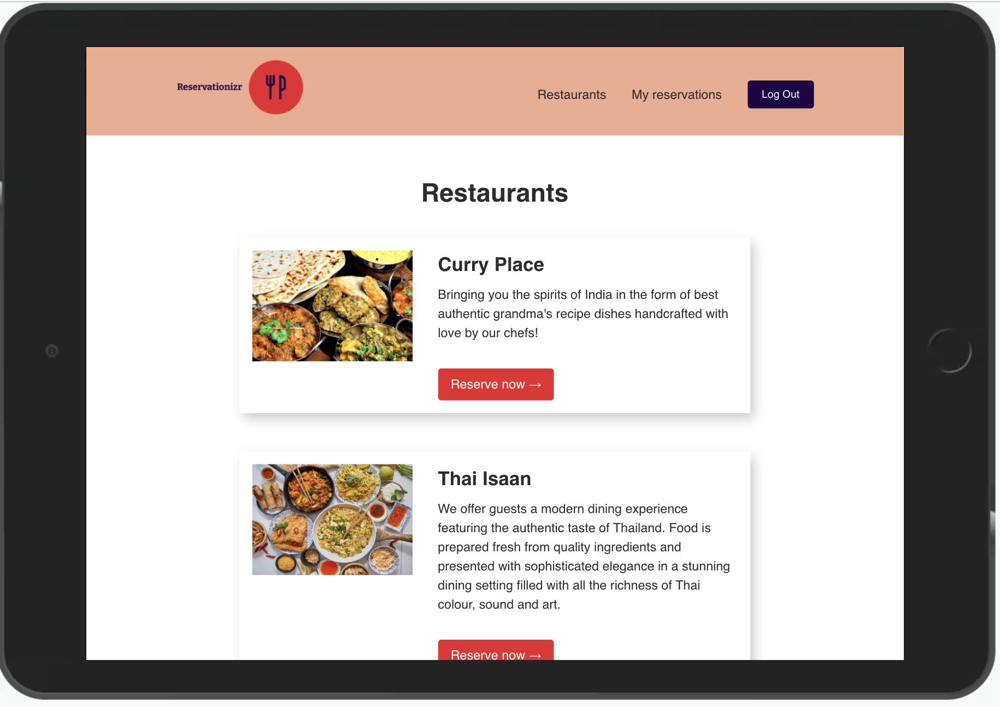
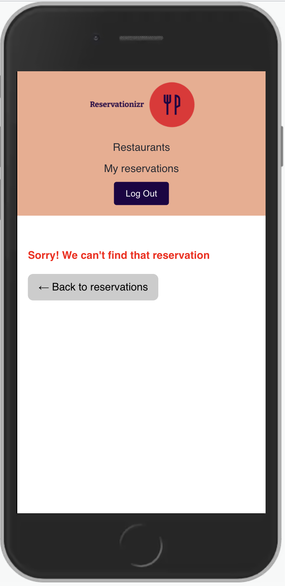

# 02 Project - Reservationizr Application - Manage Reservations

## Assessment details

- [Level 5 Learning Outcomes](./docs/learning-outcomes-l5.md)
- [Level 6 Learning Outcomes](./docs/learning-outcomes-l6.md)
---

# Scenario

You are working for a new startup, Reservationizr. It allows customers to make reservations at any of their local restaurants from one place.

The previous Software Engineer started building the application but was urgently re-assigned to a different part of the business. You need to complete the remaining user stories for the web application, following the documentation below.

Your Tech Lead can support you if you need help understanding the requirements or are blocked with something in particular.

---

# Getting started

The `client` folder contains the React Application, and the `server` folder contains the Express application.

## Client

- In a new Terminal window, type: `cd client` to change directory into the client folder
- Type `npm install` to install npm dependencies
- Type `npm start` to start the React Application

## Server

- In a new Terminal window, type: `cd server` to change directory into the server folder
- Type `npm install` to install npm dependencies
- Type `npm start` to start the Express Server

## MongoDB Database

- In a new Terminal, type `docker-compose up` to start the MongoDB server in a Docker container
- Connect to MongoDB using  [MongoDB Compass](https://www.mongodb.com/products/compass). Create a database named `mongo`, a collection named `restaurants`, and load data from the [data](./data) folder into the database.

## Understand what already exists

The previous developer has left you some code. Run the React Application and Express API, and navigate through the folder structures to understand what exists and where you need to write your code. 

Make sure you understand what API requests and responses you need to create. In particular, pay attention to the different status codes that are specified.

Once you have everything up and running and have familiarised yourself with the codebase, you can complete the following customer stories.

---

# Architecture diagrams

---

# API specification

To view the documentation for the API specification:

1. Open a Terminal in VS Code for this project
2. Type `cd server` to change directory into the server folder
3. Type `npm run docs` to start a web server with API documentation
4. Open the link displayed in your browser (it's automatically copied to your clipboard)
   
   

## Load the API Specification in Insomnia

You can automatically load all the available endpoints in Insomnia.

Watch the [video tutorial](https://www.loom.com/share/dfaf8b47c6924f5ba04ce84dd1bdea1b), or follow the instructions below:

1. Go to the Insomnia Dashboard
2. Click the purple `Create` button
3. Select `File`.
4. Navigate into this exercise folder, and choose `server/e2e/api-spec.yml`.
5. Import as a `Request Collection`.
6. You can then open the Reservationizr API 1.0 Collection. Insomnia will load the endpoints for you.

---

## User Story #1 - View all restaurants

- **As a** restaurant connoisseur
- **I want** to view a list of restaurants
- **So that** I can choose the one I want to make a reservation for

**Acceptance criteria**

- When visiting http://localhost:3000 in the React application, a list of restaurants are displayed. 
- The page matches the design.
- The route meets the API specification, and the automated API Specification test passes for this route
- The code for the API is well tested with automated tests

### Design brief

---

## User Story #2 - Book a reservation

- **As a** restaurant connoisseur
- **I want** to book a reservation at a restaurant
- **So that** I can enjoy a meal there

**Acceptance criteria**

- Given the customer is viewing the list of restaurants in the React application, when the `Reserve now` button is clicked for a restaurant, then the customer is redirected to the `/restaurants/:restaurantId/reserve` route
- Given the customer is unauthenticated in the React application, when visiting the `/restaurants/:restaurantId/reserve` route, then the customer is redirected to the Auth0 Login page
- Given the customer is authenticated in the React application, when visiting the `/restaurants/:restaurantId/reserve` route, then a form is displayed to make a new reservation for the restaurant. 
- Given the reservation form has been completed, when the form is submitted, then a new reservation is created by calling the API, and the customer is redirected to the `/reservations` route
  - **Note:** when authenticated, the user's id is stored on `req.user.sub` in the Express route handler.
- Given the reservation form has been filled in, when the customer chooses a date in the past, then the customer cannot create a reservation
- The route meets the API specification, and the automated API Specification test passes for this route. 
  - **Note** For this story, you need to build two routes (to create a resevation and to get the restaurant name): Create a reservation, and read a single restaurant (see technical implementation below).
  - **Note** To make the tests for this route pass in GitHub, see the note below on adding Auth0 credentials to the GitHub repository.
- The code for the API is well tested with automated tests Tests include happy and negative test cases.
- The Create Reservation page should match the design.
   - **Note** Use [react-datepicker](https://github.com/Hacker0x01/react-datepicker) for the Date input

### Technical implementation

To get the restaurant name, you will need to build an API route for `/restaurants/:id` and make a request to that endpoint in the `CreateReservation.js` component.

### Design brief

### Configure your GitHub repository for automated tests

[Follow the tutorial](docs/github-secrets.md) to add Auth0 credentials to your Git repository. This will configure the API Specification tests that run in GitHub.

---

## User Story #3 - View all my reservations

- **As a** restaurant connoisseur
- **I want** to view the reservations I have made
- **So that** I can be reminded of when my next reservation is

**Acceptance criteria**

- Given the customer is unauthenticated in the React application, when visiting the `/reservations` route, then the customer is redirected to the Auth0 Login page.
- Given the customer is authenticated in the React application, when visiting the `/reservations` route, then all the reservations the authenticated customer has made are displayed on the page.
  - **Note** If another user authenticates, they **should not** be able to see other customers reservations.
- Given the customer is authenticated in the React application, when visiting the `/reservations` route, when the customer has not made any reservations, then the customer is shown a message indicating they have no reservations.
- The page matches the design.
- The route meets the API specification, and the automated API Specification test passes for this route.
- The code for the API is well tested with automated tests.

### Design brief

---

## User Story #4 - View a single reservation

- **As a** restaurant connoisseur
- **I want** to view the details for a single restaurant reservation I have made
- **So that** I can attend the reservation

**Acceptance criteria**

- Given the customer is visiting the `/reservations/:id` route in the React application, when the customer is unauthenticated, then the customer is redirected to the Auth0 Login page.
- Given the customer is visiting the `/reservations/:id` route in the React application, when the reservation is created by the customer, then the reservation is displayed to the customer.
- Given the customer is visiting the `/reservations/:id` route in the React application, when the reservation is **not** created by the customer, then a "not found" error is displayed to the customer
- The page matches the design.
- The route meets the API specification, and the automated API Specification test passes for this route.
- The code for the API is well tested with automated tests. Tests include happy and negative test cases.

### Design brief

---

## User Story #5 - Deploy your application

- **As a** customer
- **I want** to access Reservationizr on a public domain name
- **So that** I can use the web application from anywhere

**Acceptance criteria**

- The website is publicly accessible on the internet
- The website domain is added to [`website-url.txt`](website-domain.txt)

--- 

# Submit your Project

- [ ] Commits are pushed to GitHub
- [ ] Automated tests pass in GitHub
- [ ] project is submitted in Google Classroom
